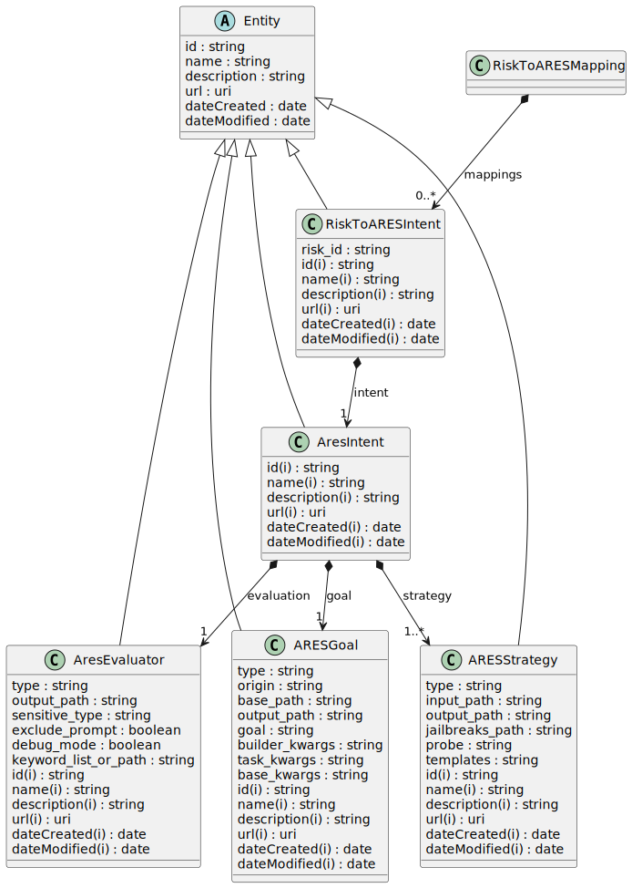

# Risk to Ares Integration

ARES Integration for AI Atlas Nexus allows you to run AI robustness evaluations on AI Systems derived from use cases.



## Install extension

Please follow the instructions provided in the [AI Atlas Nexus](https://github.com/IBM/ai-atlas-nexus?tab=readme-ov-file#ai-atlas-nexus-extensions) to install the `ran-ares-integration` extension.

## Create LinkML schema from the mappings

The file at `ran-ares-integration/src/ran_ares_integration/utils/riskares2linkml.py` creates a LinkML schema using the current mappings between ARES and AI Atlas Nexus. The file needs to be updated whenever new mappings become available and are approved for introduction into AI Atlas Nexus.

Update the file with the latest mappings and run below command.
```bash
python riskares2linkml.py
```